# @marp-team/marp-core

[](https://circleci.com/gh/marp-team/marp-core/)
[](https://codecov.io/gh/marp-team/marp-core)
[](https://www.npmjs.com/package/@marp-team/marp-core)
[](./LICENSE)

**The core of [Marp] converter.**

In order to use on Marp tools, we have extended from the slide deck framework **[Marpit]**. You can use the practical Markdown syntax, advanced features, official themes, and optional core plugins.

[marp]: https://marp.app
[marpit]: https://marpit.marp.app

## Install

Marp Core supports Node.js 20.19 or later, but highly recommend to use [actively supported Node.js versions](https://nodejs.org/en/about/releases/).

```
npm install --save @marp-team/marp-core
```

## Entrypoints

Since v5, Marp Core has been split into a lightweight core and [optional core plugins](#core-plugins).

| Entrypoint                      | Description                                                                             | Bundled size\* |
| ------------------------------- | --------------------------------------------------------------------------------------- | -------------- |
| **`@marp-team/marp-core`**      | Lightweight core with Marp's essential features                                         | 0.5MB          |
| **`@marp-team/marp-core/full`** | Full build with all core plugins<br />_(requires installing all optional dependencies)_ | 11.4MB         |

###### \*: Rough estimates. Build for browser with ESM, minified, before gzip, and includes all optional dependencies in the full entry.

We provide the full build for consistent experience of Marp toolchain, but we recommend using the lightweight core and only installing the optional plugins you need, to reduce the bundle size of your application.

<details>
<summary>About the browser helper <code>@marp-team/marp-core/browser</code></summary>
<a name="browser-helper" id="browser-helper"></a>

To show the slides correctly in the browser, Marp Core injects a helper `<script>` for the browser at the end of the slide deck by default.

If you want to control the script injection, you can disable auto injection by `browser: false` option, and can use the helper script from `@marp-team/marp-core/browser` manually.

> Don't confuse `@marp-team/marp-core/browser` with [main entrypoints](#entrypoints); It's not a conversion logic for the browser, just only provides the helper script. If you need a core feature for the browser, please bundle the main entrypoint for the browser with JavaScript bundler.

</details>

## Core plugins

Marp Core also provides optional plugins for several core features. These often require optional dependencies along with Marp Core.

| Plugin                                     | Description                                        | Optional dependency                                                                                                                                                                         |
| ------------------------------------------ | -------------------------------------------------- | ------------------------------------------------------------------------------------------------------------------------------------------------------------------------------------------- |
| **`@marp-team/marp-core/plugins/shiki`**   | Syntax highlighting powered by [Shiki]             | `shiki`                                                                                                                                                                                     |
| **`@marp-team/marp-core/plugins/mermaid`** | [Mermaid] rendering powered by [beautiful-mermaid] | `beautiful-mermaid`                                                                                                                                                                         |
| **`@marp-team/marp-core/plugins/katex`**   | Math typesetting powered by [KaTeX]                | `katex`                                                                                                                                                                                     |
| **`@marp-team/marp-core/plugins/mathjax`** | Math typesetting powered by [MathJax]              | `@mathjax/src`<br>`@mathjax/mathjax-bbm-font-extension`<br>`@mathjax/mathjax-bboldx-font-extension`<br>`@mathjax/mathjax-dsfont-font-extension`<br>`@mathjax/mathjax-mhchem-font-extension` |

[beautiful-mermaid]: https://github.com/lukilabs/beautiful-mermaid
[katex]: https://khan.github.io/KaTeX/
[mathjax]: https://www.mathjax.org/
[mermaid]: https://github.com/mermaid-js/mermaid
[shiki]: https://shiki.style/

To use the full build `@marp-team/marp-core/full`, please install all optional dependencies along with Marp Core:

```
npm install --save \
  @marp-team/marp-core \
  shiki \
  beautiful-mermaid \
  katex \
  @mathjax/src \
  @mathjax/mathjax-bbm-font-extension \
  @mathjax/mathjax-bboldx-font-extension \
  @mathjax/mathjax-dsfont-font-extension \
  @mathjax/mathjax-mhchem-font-extension
```

## Usage

Marp Core provides the **`Marp`** class, inherited from [Marpit], so the usage is almost the same as Marpit.

```javascript
import { Marp } from '@marp-team/marp-core' // or '@marp-team/marp-core/full' for full build

const marp = new Marp()
const { html, css } = marp.render('# Hello, marp-core!')
```

For more details, please refer to [Marpit usage documentation](https://marpit.marp.app/usage).

### With plugins

Add the optional core plugins selectively by chaining [`use()`](https://marpit.marp.app/usage?id=extend-by-plugins).

```javascript
import { Marp } from '@marp-team/marp-core'
import katexPlugin from '@marp-team/marp-core/plugins/katex'
import shikiPlugin from '@marp-team/marp-core/plugins/shiki'

const marp = new Marp().use(shikiPlugin()).use(katexPlugin())
```

Of course, you can also add Marpit compatible plugins.

<!--
#### [TODO] Move to "Options" section

The KaTeX plugin accepts these options:

```javascript
marp.use(
  katexPlugin({
    // Passed to KaTeX's renderToString()
    options: { strict: true },

    // Base URL or path for KaTeX fonts (must end with "/"). Set false to keep
    // KaTeX's original relative URLs. Defaults to the jsDelivr CDN.
    fontPath: '/assets/katex/fonts/',
  }),
)
```
-->

## Features

_We will only explain features extended in marp-core._ Please refer to [Marpit framework](https://marpit.marp.app) if you want to know the basic features.

---

### Marp Markdown

**Marp Markdown** is a custom Markdown flavor based on [Marpit](https://marpit.marp.app) and [CommonMark](https://commonmark.org/). Following are principle differences from the original:

- **Marpit**
  - Enabled [inline SVG slide](https://marpit.marp.app/inline-svg), [CSS container query support and loose YAML parsing](https://marpit-api.marp.app/marpit#Marpit) by default.

* **CommonMark**
  - For making secure, using some insecure HTML elements and attributes are denied by default.
  - Support [table](https://github.github.com/gfm/#tables-extension-) and [strikethrough](https://github.github.com/gfm/#strikethrough-extension-) syntax, based on [GitHub Flavored Markdown](https://github.github.com/gfm/).
  - Line breaks in paragraph will convert to `<br>` tag.
  - Slugification for headings (assigning auto-generated `id` attribute for `<h1>` - `<h6>`) is enabled by default.

---

### [Built-in official themes][themes]

We provide built-in official themes for Marp. See more details in [themes].

|           Default            |           Gaia            |           Uncover            |
| :--------------------------: | :-----------------------: | :--------------------------: |
| [![][default-theme]][themes] | [![][gaia-theme]][themes] | [![][uncover-theme]][themes] |
|  `<!-- theme: default -->`   |  `<!-- theme: gaia -->`   |  `<!-- theme: uncover -->`   |

[themes]: ./themes/
[default-theme]: https://user-images.githubusercontent.com/3993388/48039490-53be1b80-e1b8-11e8-8179-0e6c11d285e2.png
[gaia-theme]: https://user-images.githubusercontent.com/3993388/48039493-5456b200-e1b8-11e8-9c49-dd5d66d76c0d.png
[uncover-theme]: https://user-images.githubusercontent.com/3993388/48039495-5456b200-e1b8-11e8-8c82-ca7f7842b34d.png

---

### Syntax highlighting

With the [Shiki plugin](#core-plugins), Marp Core supports syntax highlighting for code fences. Define language identifier as [an info string of code fence](https://spec.commonmark.org/0.31.2/#info-string), such as ` ```js `.

````markdown
```js
import { Marp } from '@marp-team/marp-core'

// Convert Markdown slide deck into HTML and CSS
const marp = new Marp()
const { html, css } = marp.render('# Hello, marp-core!')
```
````

<p align="center">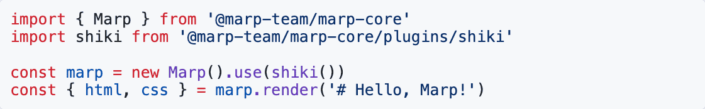</p>

Please see [Shiki's "Languages" page](https://shiki.style/languages) for supported languages and identifiers.

#### Line highlighting

You can also highlight specific lines by adding a space-separated extra attribute `{}`, just like `{1,4-5}` (means highlight 1st, and 4th to 5th lines).

````markdown
```js {1,4-5}
import { Marp } from '@marp-team/marp-core'

// Convert Markdown slide deck into HTML and CSS
const marp = new Marp()
const { html, css } = marp.render('# Hello, marp-core!')
```
````

<p align="center">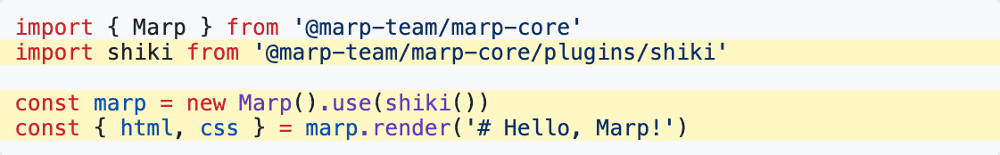</p>

#### Color customization

Colors for syntax higlighting are defined in the theme CSS as `--marp-shiki-*` CSS variables. If you want to customize the color, [you can tweak the style by `<style>` tag](https://marpit.marp.app/theme-css?id=tweak-style-through-markdown).

```html
<style>
  :root {
    --marp-shiki-foreground: #224466;
    --marp-shiki-background: #eeefff;
    --marp-shiki-line-highlight: #dddeee;
    /* ... and more variables (See the theme documentation for details) */
  }
</style>
```

For theme authors compatible with Marp Core, [the full list of CSS variables for syntax highlighting is available in the theme documentation.](./themes#css-variables-for-syntax-highlighting)

---

### Mermaid diagrams

With the [Mermaid plugin](#core-plugins), Marp Core can render some diagram types written in [Mermaid]. Put the diagram code in a code fence with `mermaid` info string.

> [!NOTE]
> Since Marp Core uses an alternative Mermaid renderer [beautiful-mermaid] for deterministic server-side output, certain diagram types, syntax, and options from [the original Mermaid][mermaid] might not be supported.
>
> You can see the full example of supported diagrams in https://agents.craft.do/mermaid.

> [!TIP]
>
> - The color of diagrams will be automatically adjusted to [the syntax highlight color](#color-customization) of the current theme.
> - If you want to just highlight the mermaid code without rendering the diagram, you can use `mermaid-raw` or `mmd` info string instead of `mermaid`.

#### [Flowchart (Graph)](https://mermaid.ai/open-source/syntax/flowchart.html)

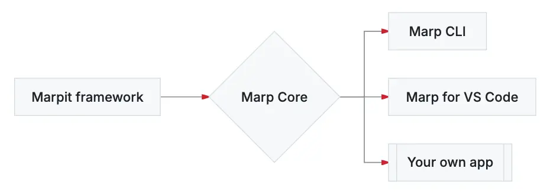

````markdown
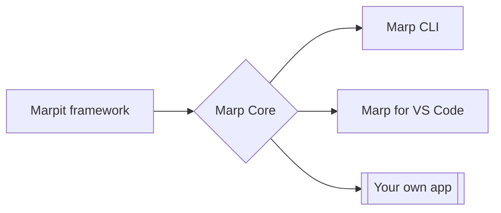
````

#### [Sequence Diagram](https://mermaid.ai/open-source/syntax/sequenceDiagram.html)

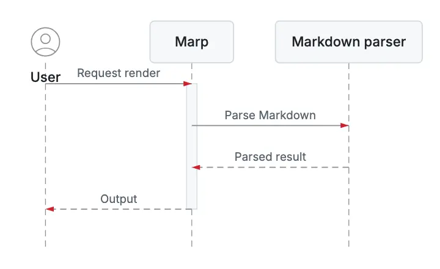

````markdown
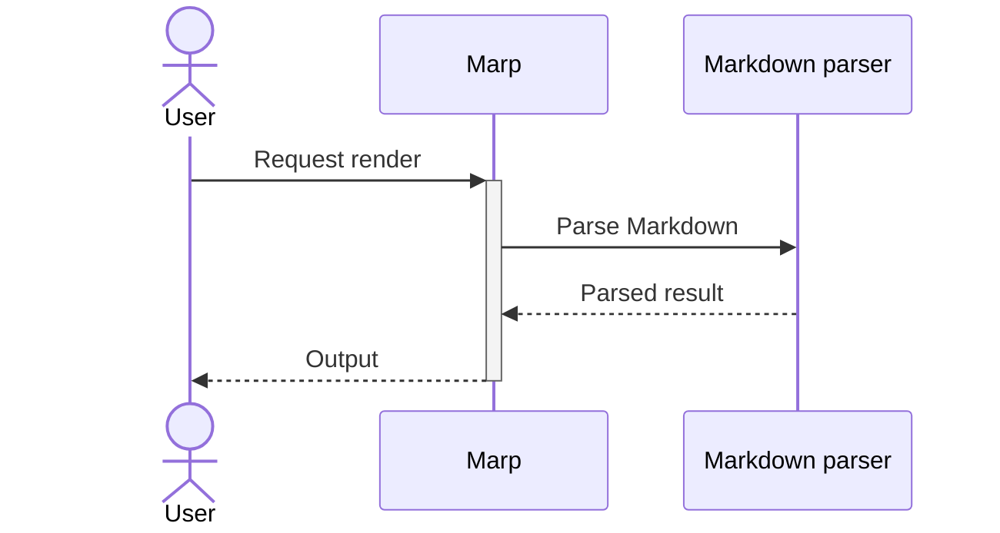
````

#### [State Diagram](https://mermaid.ai/open-source/syntax/stateDiagram.html)

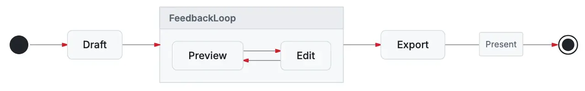

````markdown
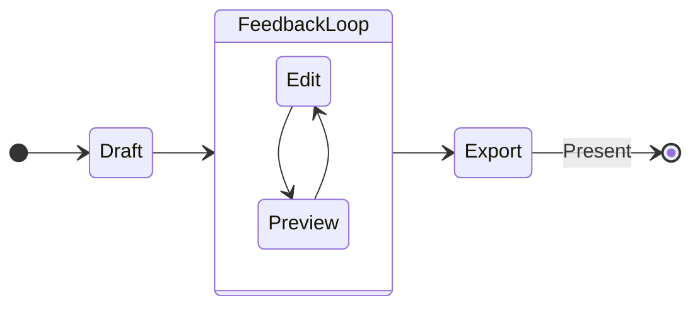
````

#### [Class Diagram](https://mermaid.ai/open-source/syntax/classDiagram.html)

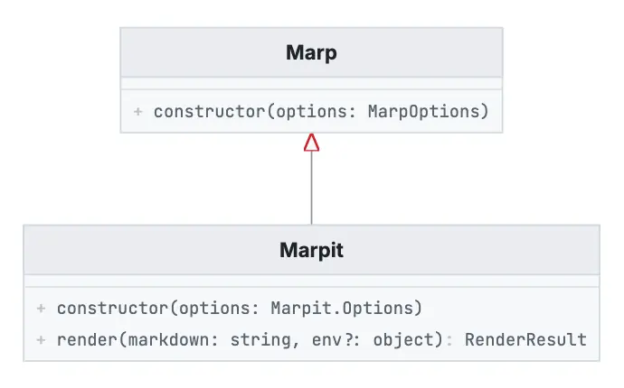

````markdown
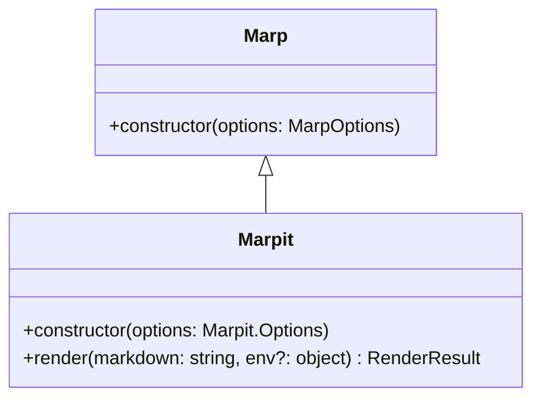
````

#### [Entity Relationship Diagram (ERD)](https://mermaid.ai/open-source/syntax/entityRelationshipDiagram.html)

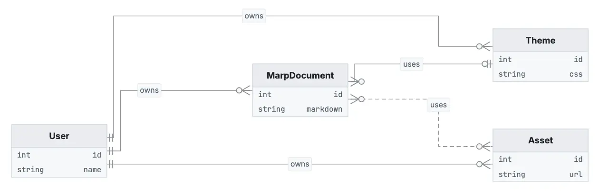

````markdown
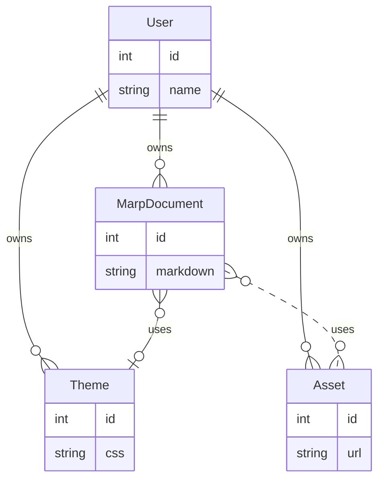
````

#### [Charts (XY Chart)](https://mermaid.ai/open-source/syntax/xyChart.html)

##### Bar chart

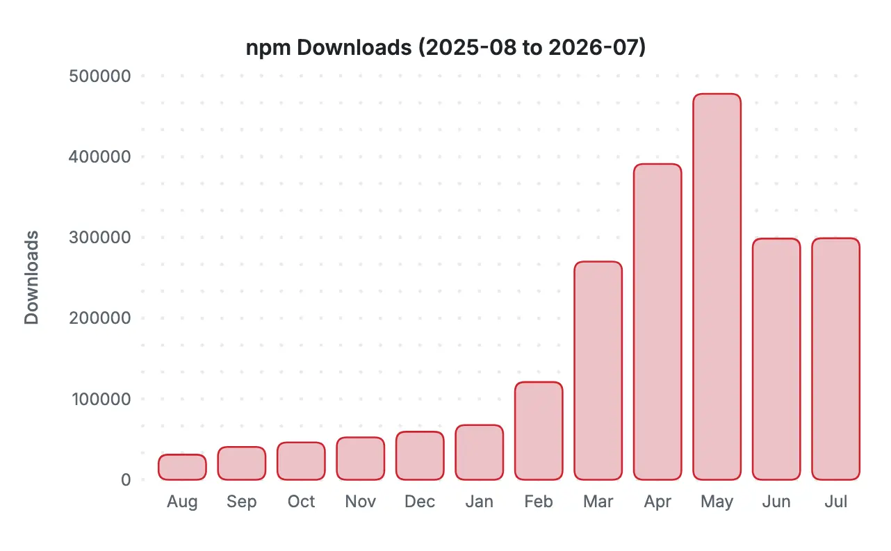

````markdown
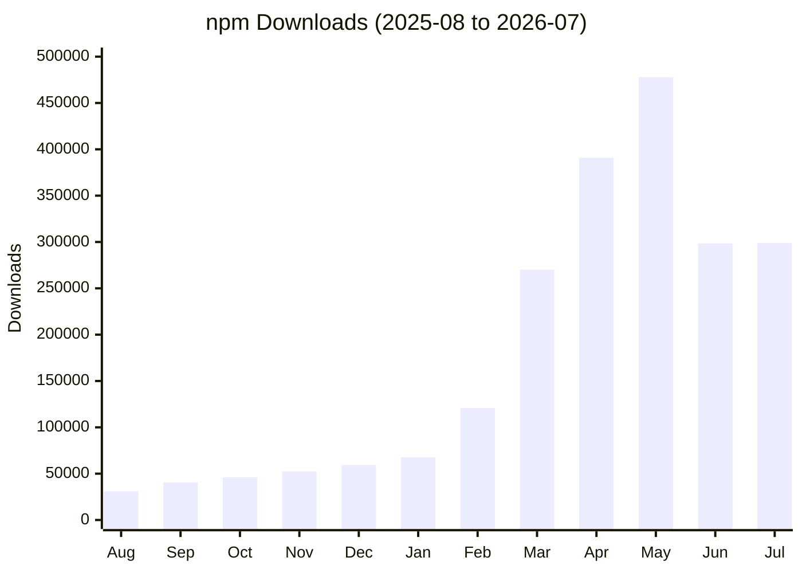
````

##### Line chart

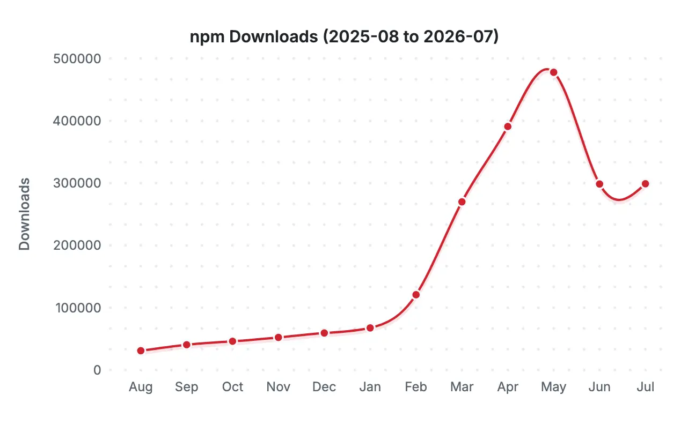

````markdown
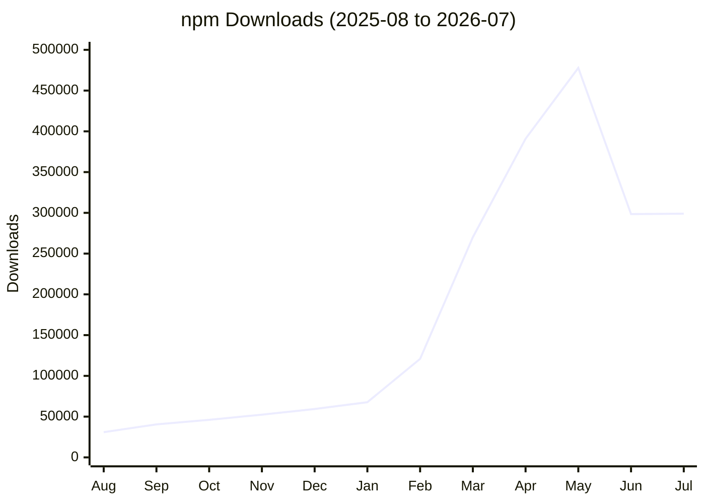
````

> [!TIP]
> You can also use `mermaid interactive` code fence to enable the interactive mode of `beautiful-mermaid`. In charts, it will show the tooltip when hovering the bar or line.
>
> ````markdown
> ```mermaid interactive
> xychart
>   ...
> ```
> ````

---

### `size` global directive

Do you want a traditional 4:3 slide size? Marp Core adds the support of `size` global directive. The extended theming system can switch the slide size easier.

```markdown
---
theme: gaia
size: 4:3
---

# A traditional 4:3 slide
```

[Built-in themes for Marp][themes] have provided `16:9` (1280x720) and `4:3` (960x720) preset sizes.

#### Define size presets in custom theme CSS

If you want to use more size presets in your own theme, you have to define `@size` metadata(s) in theme CSS. [Learn in the document of theme metadata for Marp Core][metadata].

Theme author does not have to worry an unintended design being used with unexpected slide size because user only can use pre-defined presets by author.

[metadata]: ./themes#metadata-for-additional-features

---

### Emoji support

Emoji shortcode (like `:smile:`) and Unicode emoji 😄 will convert into the SVG vector image provided by [twemoji](https://github.com/jdecked/twemoji) .

It could always render emoji with high resolution, and gets deterministic rendering in every format.

---

### Math typesetting

With the [KaTeX or MathJax plugin](#core-plugins), Marp Core supports [Pandoc's Markdown style](https://pandoc.org/MANUAL.html#math) math typesetting. Surround your formula by `$...$` to render math as inline, and `$$...$$` to render as block.


```tex
Render inline math such as $ax^2+bc+c$.

$$ I_{xx}=\int\int_Ry^2f(x,y)\cdot{}dydx $$

$$
f(x) = \int_{-\infty}^\infty
    \hat f(\xi)\,e^{2 \pi i \xi x}
    \,d\xi
$$
```

You can choose between [MathJax] and [KaTeX] in the [`math` global directive](#math-global-directive) or [JS constructor option](#math-constructor-option). If added both plugins, Marp Core uses the first registered plugin as the default library.

In the full build, MathJax is preferred by default for better rendering and syntax support, while KaTeX is faster if you have a lot of formulas.

#### `math` global directive

Through the `math` global directive, Marp Core supports declaring the math library to use in the current Markdown. The selected library must have already been registered through its plugin.

Set **`mathjax`** or **`katex`** in the `math` global directive like this:

```markdown
---
# Declare to use KaTeX in this Markdown
math: katex
---

$$
\begin{align}
x &= 1+1 \tag{1} \\
  &= 2
\end{align}
$$
```

For deterministic rendering, we recommend declaring the library whenever you use math typesetting.

> [!WARNING]
> The declaration of math library is given priority over [`math` JS constructor option](#math-constructor-option), but you cannot turn on again via `math` global directive if disabled math typesetting by the constructor.

---

### Auto-scaling features

Marp Core has some auto-scaling features:

- [**Fitting header**](#fitting-header): Get bigger heading that fit onto the slide by `# <!--fit-->`.
- [**Auto-shrink the block**](#auto-shrink-the-block): Prevent sticking out the some block elements from the right of the slide.
  - Code block: ` ``` `
  - KaTeX math block: `$$...$$`

> [!NOTE]
> Auto-scaling is designed for horizontal scaling. In vertical, the scaled element still may stick out from bottom of slide if there are a lot of contents around it.

#### Fitting header

When the headings contains `<!-- fit -->` comment, the size of headings will resize to fit onto the slide size.

```markdown
# <!-- fit --> Fitting header
```

This syntax is similar to [Deckset's `[fit]` keyword](https://docs.decksetapp.com/English.lproj/Formatting/01-headings.html), but we use HTML comment to hide a fit keyword on Markdown rendered as document.

#### Auto-shrink the block

Some of blocks will be shrunk to fit onto the slide. It is useful preventing stuck out the block from the right of the slide.

#### How to enable

Auto-scaling is available only if defined [`@auto-scaling` metadata][metadata] in an using theme CSS, for making controllable expected style and DOM structure by theme author.

```css
/*
 * @theme foobar
 * @auto-scaling true
 */
```

If you're the theme author, you can control target elements which enable auto-scaling [by using metadata keyword(s).][metadata]

All of [Marp Core's built-in themes][themes] are ready to use full-featured auto scalings. If you created a theme based on built-in themes by `@import`, you can use auto-scaling features without any additional settings.

This feature depends to inline SVG, so note that it will not working if disabled [Marpit's `inlineSVG` mode](https://github.com/marp-team/marpit#inline-svg-slide-experimental) by setting `inlineSVG: false` in constructor option.

---

## Constructor options

You can customize a behavior of Marp parser by passing an options object to the constructor. You can also pass together with [Marpit constructor options](https://marpit-api.marp.app/marpit#Marpit).

> [!NOTE]
>
> [Marpit's `markdown` option](https://marpit-api.marp.app/marpit#Marpit) is accepted only object options because of always using CommonMark.

```javascript
const marp = new Marp({
  // marp-core constructor options
  html: true,
  emoji: {
    shortcode: true,
    unicode: false,
    twemoji: {
      base: '/resources/twemoji/',
    },
  },
  math: 'katex',
  minifyCSS: true,
  script: {
    source: 'cdn',
    nonce: 'xxxxxxxxxxxxxxx',
  },
  slug: false,

  // It can be included Marpit constructor options
  looseYAML: false,
  markdown: {
    breaks: false,
  },
})
```

### `html`: _`boolean`_ | _`object`_

Setting whether to render raw HTML in Markdown. It's an alias to `markdown.html` ([markdown-it option](https://markdown-it.github.io/markdown-it/#MarkdownIt.new)) but has additional feature about HTML allowlist.

- (default): Use Marp's default allowlist.
- `true`: The all HTML will be allowed.
- `false`: All HTML except supported in Marpit Markdown will be disallowed.

By passing `object`, you can set the allowlist to specify allowed tags and attributes.

```javascript
// Specify tag name as key, and attributes to allow as string array.
{
  a: ['href', 'target'],
  br: [],
}
```

```javascript
// You may use custom attribute sanitizer by passing object.
{
  img: {
    src: (value) => (value.startsWith('https://') ? value : '')
  }
}
```

By default, Marp Core allows known HTML elements and attributes that are considered as safe. That is defined as a readonly `html` member in `Marp` class. [See the full default allowlist in the source code.](src/html/allowlist.ts)

> [!NOTE]
> Whatever any option is selected, `<!-- HTML comment -->` and `<style>` tags are always parsed by Marpit for directives / tweaking style.

### `emoji`: _`object`_

Setting about emoji conversions.

- **`shortcode`**: _`boolean` | `"twemoji"`_
  - By setting `false`, it does not convert any emoji shortcodes.
  - By setting `true`, it converts emoji shortcodes into Unicode emoji. `:dog:` → 🐶
  - By setting `"twemoji"` string, it converts into twemoji vector image. `:dog:` →  _(default)_

* **`unicode`**: _`boolean` | `"twemoji"`_
  - It can convert Unicode emoji into twemoji when setting `"twemoji"`. 🐶 →  _(default)_
  - If you not want this aggressive conversion, please set `false`.

- **`twemoji`**: _`object`_
  - **`base`**: _`string`_ - Corresponds to [twemoji's `base` option](https://github.com/twitter/twemoji#object-as-parameter). If not specified, Marp Core will use [online emoji images through jsDelivr CDN](https://cdn.jsdelivr.net/gh/twitter/twemoji@14.0.2/assets/svg/).
  - **`ext`**: _`"svg"` | `"png"`_ - Setting the file type of twemoji images. _(`svg` by default)_

> **For developers:** When you setting `unicode` option as `true`, Markdown parser will convert Unicode emoji into tokens internally. The rendering result is same as in `false`.

### `math`: _`boolean` | `"mathjax"` | `"katex"`_ <a name="math-constructor-option" id="math-constructor-option"></a>

Enable or disable [math typesetting](#math-typesetting) syntax and [`math` global directive](#math-global-directive). `true` by default, but it requires at least one of the math core plugins to be registered.

If enabled, Marp Core uses the first registered math plugin as the default library. You can choose the default library by passing **`"mathjax"`** or **`"katex"`** (The full build prefers MathJax).

<!--
- **`lib`**: _`"mathjax"` | `"katex"`_
  - Choose the default library for math typesetting. If omitted, Marp Core uses the first registered math plugin.

Configure KaTeX itself through [`katexPlugin()` options](#core-plugins).
-->

### `minifyCSS`: _`boolean`_

Enable or disable minification for rendered CSS. `true` by default.

### `script`: _`boolean` | `object`_

Setting about an injected helper script for the browser context. This script is necessary for applying [WebKit polyfill](https://github.com/marp-team/marpit-svg-polyfill) and rendering [auto-scaled elements](#auto-scaling-features) correctly.

- **`true` (default)**: Inject the inline helper script into after the last of slides.
- **`false`**: Don't inject helper script. Developer must execute a helper script manually, exported in [`@marp-team/marp-core/browser`](#browser-helper). It's suitable to the fully-controlled web application.

You can control details of behavior by passing `object`.

- **`source`**: _`string`_ - Choose the kind of script.
  - **`inline`**: Inject the inline script. It would work correctly also in the environment that there is not network. (default)
  - **`cdn`**: Inject script referred through [jsDelivr CDN](https://www.jsdelivr.com/). It's better choice on the restricted environment by [CSP](https://developer.mozilla.org/en-US/docs/Web/HTTP/CSP).

* **`nonce`**: _`string`_ - Set [`nonce` attribute](https://developer.mozilla.org/en-US/docs/Web/HTML/Element/script#attr-nonce) of `<script>`.

### `slug`: _`boolean` | `function` | `object`_

Configure slugification for headings. By default, Marp Core tries to make the slug by the similar way to GitHub. It should be compatible with [Markdown Language Server](https://code.visualstudio.com/blogs/2022/08/16/markdown-language-server).

- **`true` (default)**: Assign auto-generated `id` attribute from the contents of `<h1>`-`<h6>` headings.
- **`false`**: Disable auto-assigning slug to headings.
- _`function`_: Set the custom slugifier function, that takes one argument: the content of the heading. It must return a generated slug string.

You can control details of behavior by passing `object`.

- **`slugifier`**: _`function`_ - Set the custom slugifier function.
- **`postSlugify`**: _`function`_ - Set the post-process function after generated a slug. The function takes 2 arguments, the string of generated slug and the index of the same slug, and must return a string for assigning to `id` attribute of the heading.

  By default, Marp Core applies the post-process to avoid assigning duplicated `id`s in the document: ``(slug, index) => (index > 0 ? `${slug}-${index}` : slug)``

  Assigning the custom post-process function is also helpful to append the custom prefix and suffix to the generated slug: `` (slug, i) => `prefix:${slug}:${i}` ``

> [!NOTE]
> Take care not to confuse Marp Core's `slug` option and [Marpit's `anchor` option](https://marpit-api.marp.app/marpit#:~:text=Description-,anchor,-boolean%20%7C%20Marpit). `slug` is for the Markdown headings, and `anchor` is for the slide elements.
>
> `Marp` class is extended from `Marpit` class so you can customize both options in the constructor. To fully disable auto-generated `id` attribute, set both options as `false`. (This is important to avoid breaking your Web application by user's Markdown contents)

## Contributing

Are you interested in contributing? Please see [CONTRIBUTING.md](.github/CONTRIBUTING.md) and [the common contributing guideline for Marp team](https://github.com/marp-team/.github/blob/master/CONTRIBUTING.md).

## Author

Managed by [@marp-team](https://github.com/marp-team).

-  Yuki Hattori ([@yhatt](https://github.com/yhatt))

## License

This package releases under the [MIT License](LICENSE).
