# Markdown features

This guide covers Markdown features available to authors writing slides with Marp Core.

> [!NOTE]
> For basic slide syntax, directives, and image syntax inherited from Marpit framework, see the [Marpit documentation](https://marpit.marp.app/markdown).

- 📦 [**Built-in features**](#built-in-features)
  - [Marp Markdown](#marp-markdown)
  - [Themes](#themes)
  - [Emoji](#emoji)
  - [Slide size](#slide-size)
  - [Auto-scaling](#auto-scaling)

* 🧩 [**Optional features by core plugins**](#optional-features-by-core-plugins)
  - [Syntax highlighting](#syntax-highlighting)
  - [Mermaid diagrams](#mermaid-diagrams)
  - [Math typesetting](#math-typesetting)

---

# Built-in features

## Marp Markdown

Marp Markdown is based on [Marpit Markdown](https://marpit.marp.app/markdown) and [CommonMark](https://commonmark.org/). Marp Core changes the defaults as follows:

- **Changes from Marpit Markdown**
  - Enabled [inline SVG slide](https://marpit.marp.app/inline-svg), [CSS container query support and loose YAML parsing](https://marpit-api.marp.app/marpit#Marpit) by default.

* **Changes from CommonMark**
  - Supports [GitHub Flavored Markdown](https://github.github.com/gfm/) [tables](https://github.github.com/gfm/#tables-extension-) and [strikethrough](https://github.github.com/gfm/#strikethrough-extension-).
  - Line breaks in paragraph will convert to `<br>` tag.
  - Generates GitHub-like IDs for headings (slugifications).
  - Allows only known-safe HTML elements and attributes by default.

Applications can change these defaults through [constructor options](./configuration.md#constructor-options).

## [Themes]

[themes]: #themes

Marp Core includes 3 built-in themes:

<table>
  <thead>
    <tr>
      <th align="center">Default</th>
      <th align="center">Gaia</th>
      <th align="center">Uncover</th>
    </tr>
  </thead>
  <tbody>
    <tr>
      <td align="center">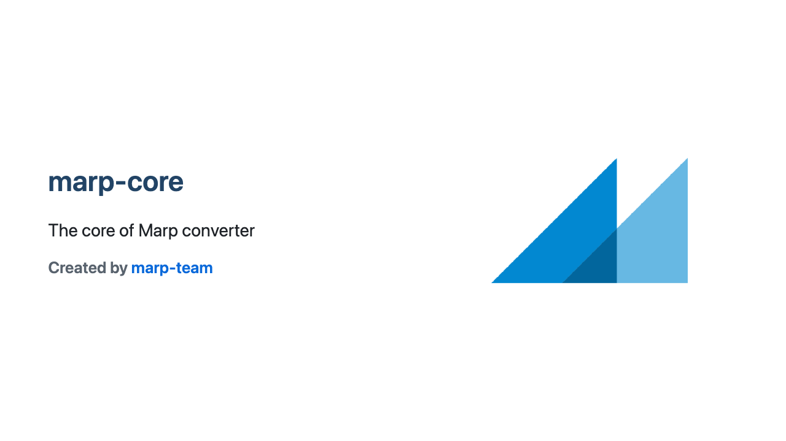</td>
      <td align="center">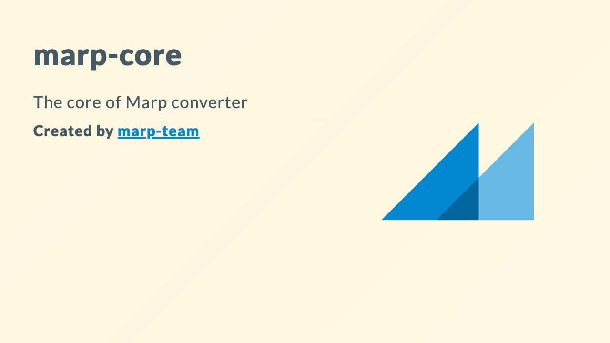</td>
      <td align="center">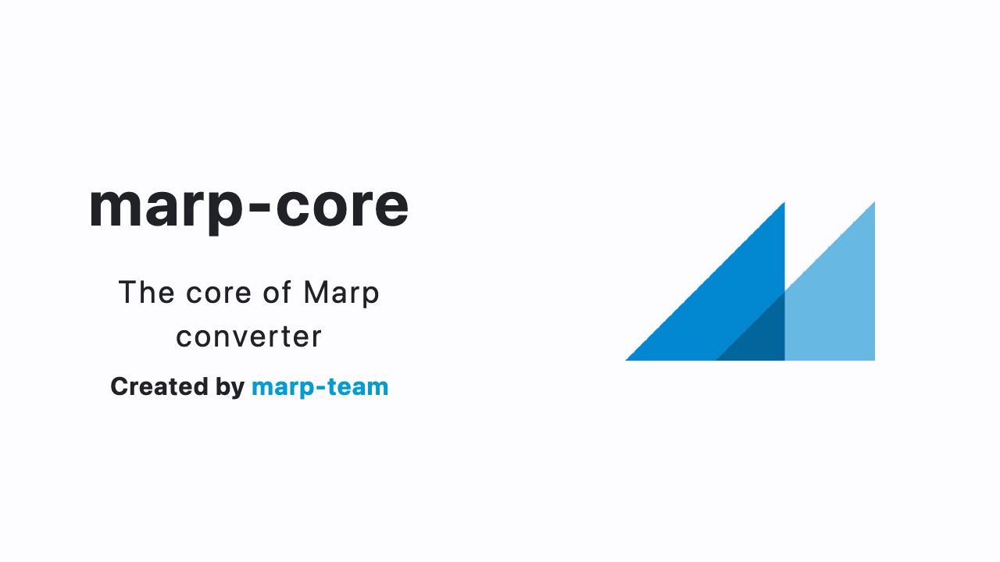</td>
    </tr>
    <tr>
      <td align="center"><code>&lt;!-- theme: default --&gt;</code></td>
      <td align="center"><code>&lt;!-- theme: gaia --&gt;</code></td>
      <td align="center"><code>&lt;!-- theme: uncover --&gt;</code></td>
    </tr>
  </tbody>
</table>

See [themes documentation][themes] for details.

## Emoji

Emoji shortcodes such as `:smile:` and Unicode emoji such as 😄 are converted to SVG images provided by [Twemoji](https://github.com/jdecked/twemoji). This keeps emoji rendering sharp and consistent across output formats.

Applications can change shortcode, Unicode, and Twemoji behavior through the [`emoji` constructor option](./configuration.md#emoji).

## Slide size

Use the `size` global directive to select a size preset defined by the current theme:

```markdown
---
theme: gaia
size: 4:3
---

# A traditional 4:3 slide
```

Every [built-in theme][themes] provides **`16:9`** (1280×720: default) and **`4:3`** (960×720) presets.

Theme authors can [define custom presets](./theme-authoring.md#slide-size-presets).

## Auto-scaling

The auto-scaling feature helps block content fit seamlessly into your slides.

While this feature depends on theme support, it is natively supported by all [built-in themes][themes]. Theme authors should see [how to enable auto scaling](./theme-authoring.md#auto-scaling) by setting `@auto-scaling` metadata.

### Fitting header

Add `<!-- fit -->` inside a heading (`#` ~ `######`) to scale it to the slide width:

```markdown
# <!-- fit --> Fitting header
```

### Auto-shrink blocks

Some wide blocks are automatically shrunk when the theme enables their corresponding auto scaling features.

- **Code block**
- **KaTeX math block** (when [the KaTeX plugin](#math-typesetting) is registered)

> [!NOTE]
>
> - Auto scaling is only horizontal. Content may still overflow the bottom of a slide.
> - If [`inlineSVG` option](https://marpit.marp.app/inline-svg) was disabled, auto scaling will not be applied.

---

# Optional features by core plugins

## Syntax highlighting

> **Requirements: `@marp-team/marp-core/plugins/shiki`** plugin and `shiki` dependency (`npm install --save shiki`)

A code fence is highlighted when its info string contains a supported language identifier.

````markdown
```js
import { Marp } from '@marp-team/marp-core'
import shiki from '@marp-team/marp-core/plugins/shiki'

const marp = new Marp().use(shiki())
const { html, css } = marp.render('# Hello, Marp!')
```
````

<p align="center"></p>

Refer to [Shiki's language list](https://shiki.style/languages) for supported identifiers.

Colors for syntax highlighting can be customized with [CSS variables](./theme-authoring.md#syntax-highlighting).

### Line highlighting

Add a space-separated `{}` attribute after the language.

````markdown
```js {2,4-5}
import { Marp } from '@marp-team/marp-core'
import shiki from '@marp-team/marp-core/plugins/shiki'

const marp = new Marp().use(shiki())
const { html, css } = marp.render('# Hello, Marp!')
```
````

<p align="center"></p>

## Mermaid diagrams

> **Requirements: `@marp-team/marp-core/plugins/mermaid` plugin** and `beautiful-mermaid` dependency (`npm install --save beautiful-mermaid`)

Use a `mermaid` code fence to render [mermaid](https://mermaid.ai/open-source/) diagrams.

````markdown
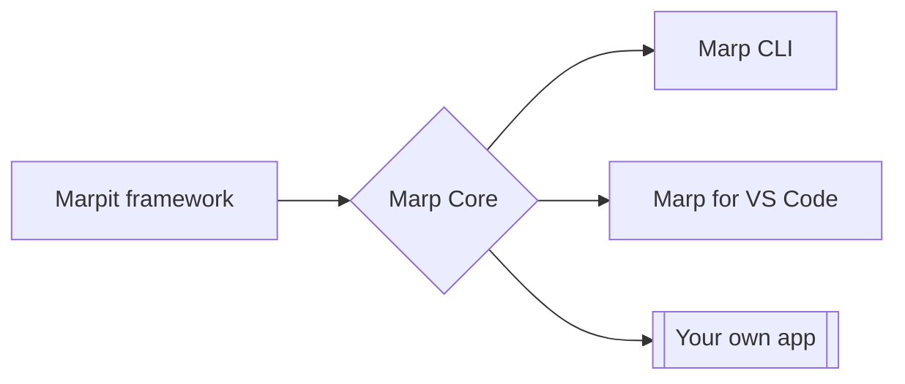
````

<p align="center"></p>

Marp Core uses [beautiful-mermaid](https://github.com/lukilabs/beautiful-mermaid) for deterministic server-side output. It supports the following diagram types:

<details>
<summary><b>Flowchart</b></summary>

````markdown

````

<p align="center"></p>
</details>

<details>
<summary><b>Sequence Diagram</b></summary>

````markdown
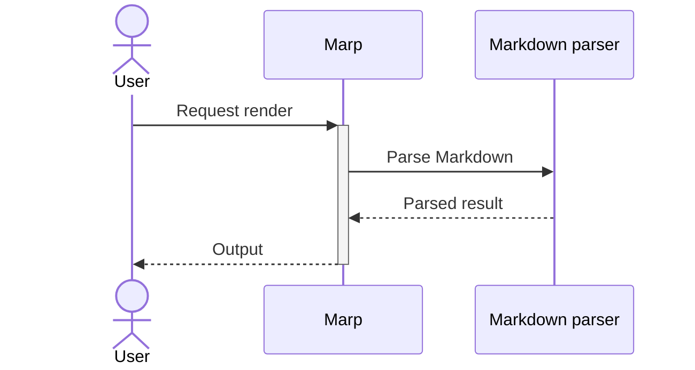
````

<p align="center"></p>
</details>

<details>
<summary><b>State Diagram</b></summary>

````markdown
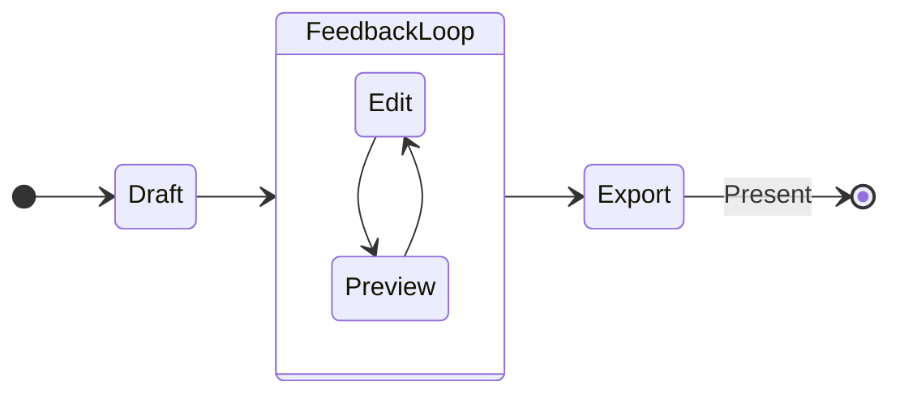
````

<p align="center"></p>
</details>

<details>
<summary><b>Class Diagram</b></summary>

````markdown
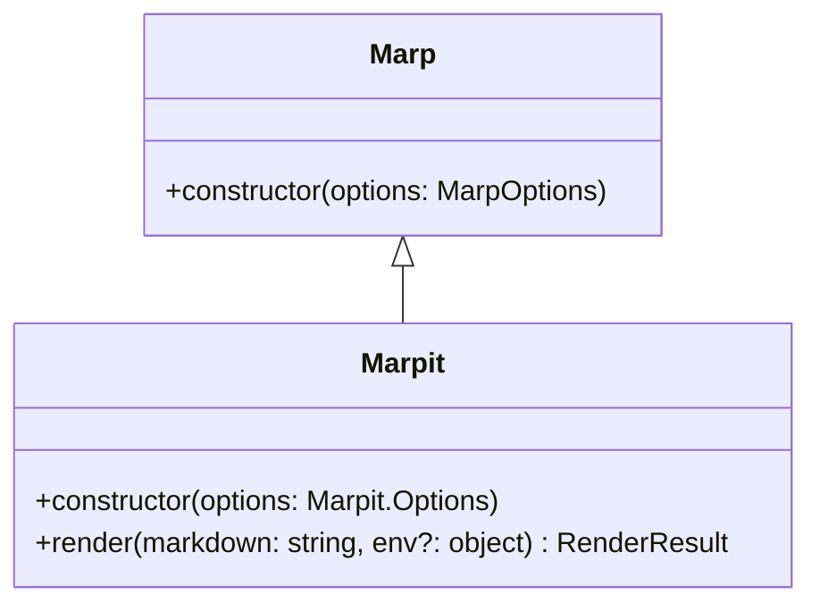
````

<p align="center"></p>
</details>

<details>
<summary><b>Entity Relationship Diagram (ERD)</b></summary>

````markdown
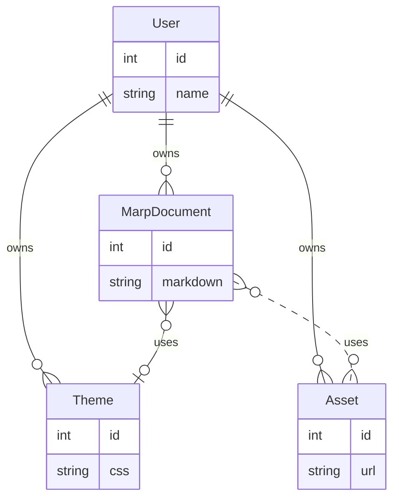
````

<p align="center"></p>
</details>

<details>
<summary><b>XY Chart:</b> Bar chart</summary>

````markdown
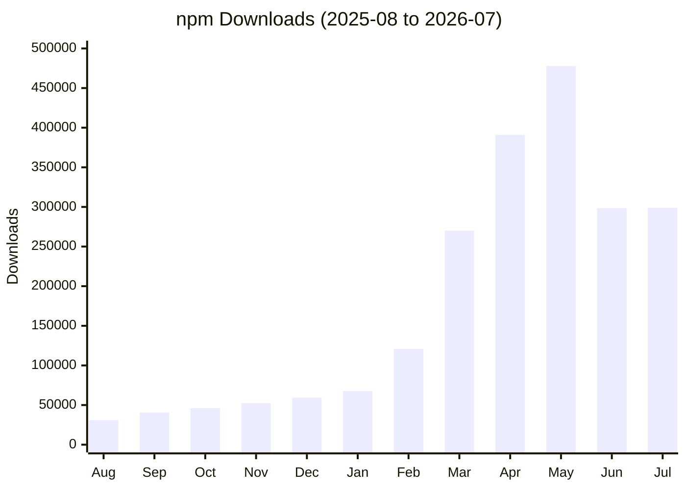
````

<p align="center"></p>
</details>

<details>
<summary><b>XY Chart:</b> Line chart</summary>

````markdown
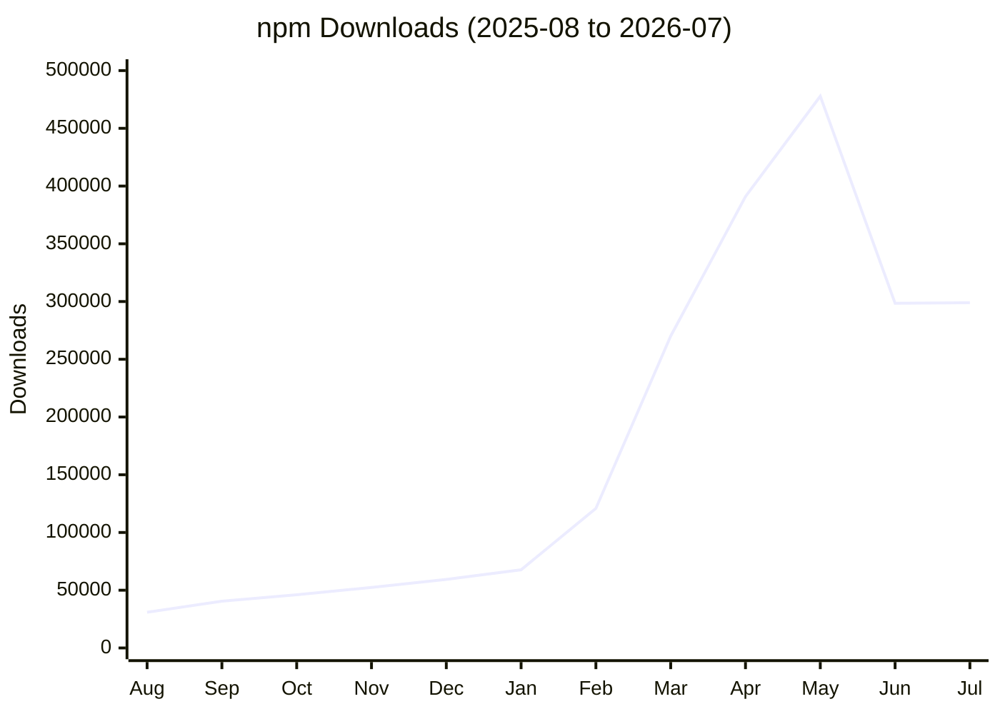
````

<p align="center"></p>
</details>

### Interactive diagrams

Add `interactive` after the info string to enable beautiful-mermaid's interactive mode. For example, charts show a tooltip when hovering over a bar or line.

````markdown
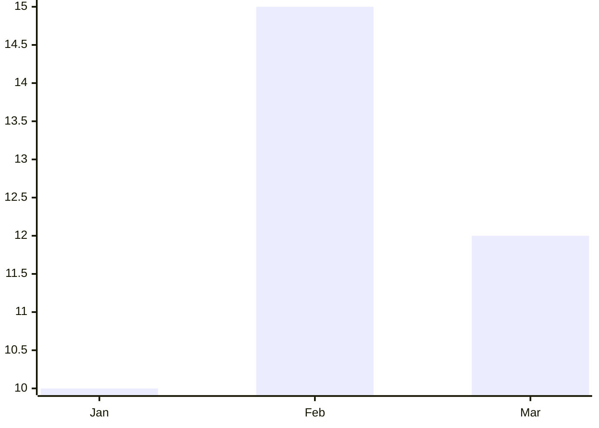
````

> [!NOTE]
>
> - Some Mermaid syntax may not be supported by `beautiful-mermaid` renderer. You can see the full list of supported diagrams in https://agents.craft.do/mermaid.
> - To display source code instead of rendering a diagram, use `mermaid-raw` or `mmd` as the info string.
> - Diagram colors follow the current theme of syntax highlighting. Theme authors can override them with [CSS variables](./theme-authoring.md#mermaid-diagrams).

## Math typesetting

> **Requirements** (At least one):
>
> - **`@marp-team/marp-core/plugins/katex` plugin** and `katex` dependency (`npm install --save katex`)
> - **`@marp-team/marp-core/plugins/mathjax` plugin** and MathJax dependencies (`npm install --save @mathjax/src @mathjax/mathjax-bbm-font-extension @mathjax/mathjax-bboldx-font-extension @mathjax/mathjax-dsfont-font-extension @mathjax/mathjax-mhchem-font-extension`)

Marp Core supports [Pandoc-style math typesetting](https://pandoc.org/MANUAL.html#math), powered by [MathJax](https://www.mathjax.org/) and [KaTeX](https://katex.org/):

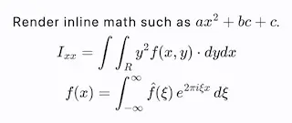

```tex
Render inline math such as $ax^2+bx+c$.

$$
f(x) = \int_{-\infty}^\infty
    \hat f(\xi)\,e^{2 \pi i \xi x}
    \,d\xi
$$
```

### Choose a math library

Use the `math` global directive to select the library for the current Markdown document:

```markdown
---
math: katex
---

$$
\begin{align}
x &= 1+1 \tag{1} \\
  &= 2
\end{align}
$$
```

For deterministic rendering, we recommend to declare `math: mathjax` or `math: katex` whenever a document uses math.

> [!NOTE]
>
> - The math library of first registered plugin will be used as the default. In the full build `@marp-team/marp-core/full`, MathJax is the default library.
> - In general, MathJax has better rendering and syntax support, but KaTeX is faster rendering if you had a lot of formulas.
> - See [Math configuration](./configuration.md#math) for the application-side settings. If the application has disabled math, the `math` directive will be ignored.
