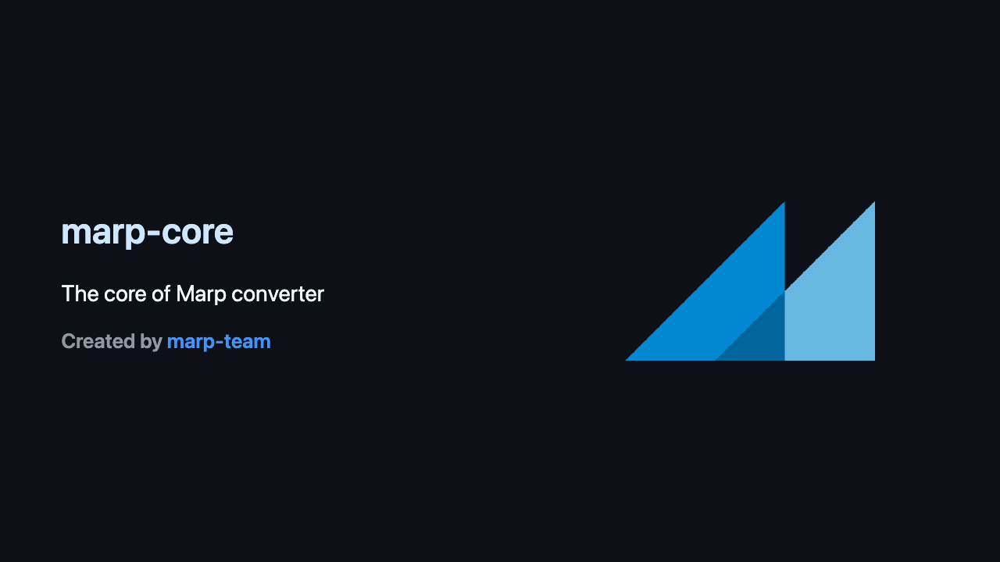
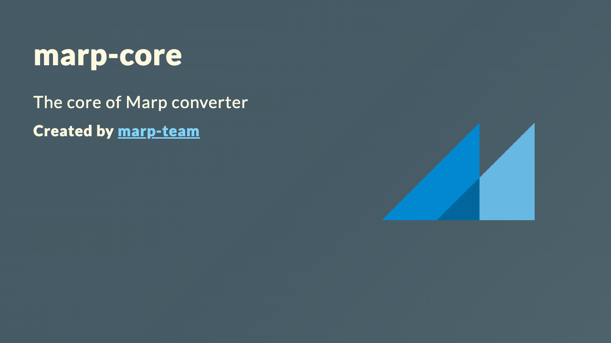
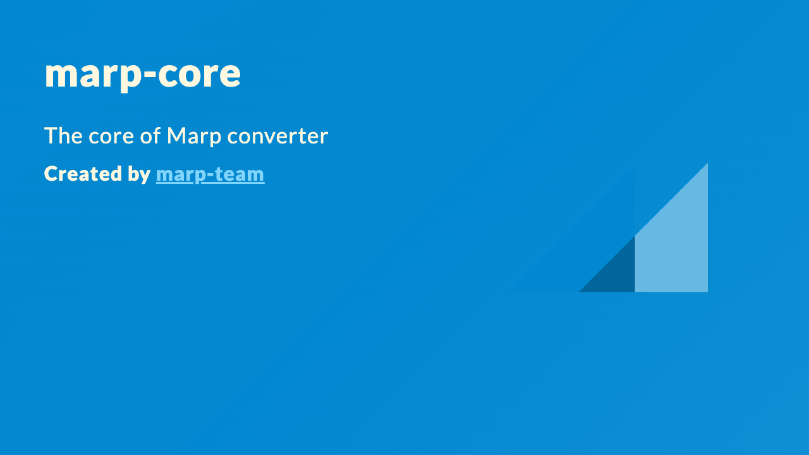
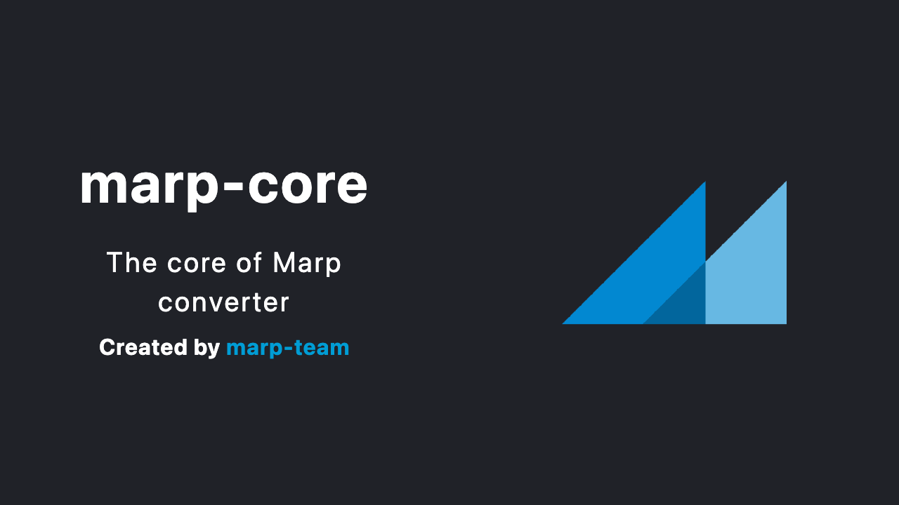
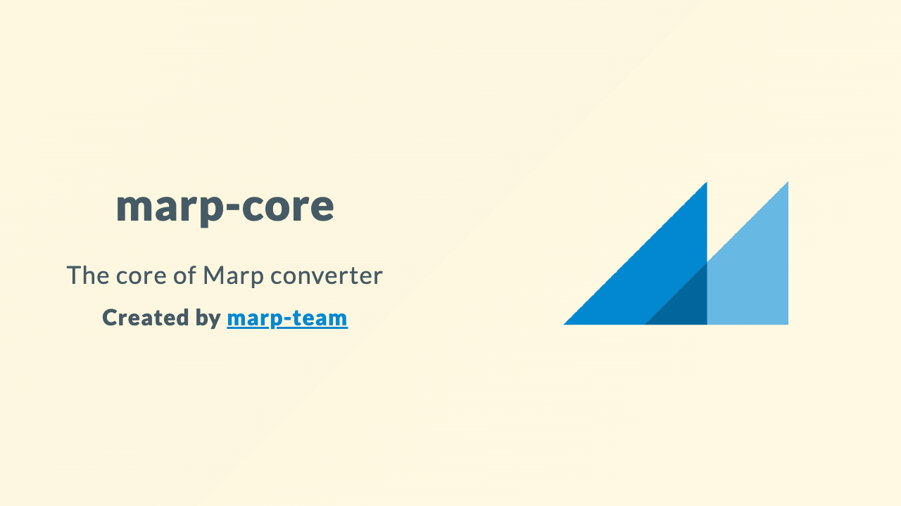

# Marp Core built-in themes

We provide some nice built-in themes in Marp Core. You can choose a favorite theme by using [Marpit's `theme` global directive](https://marpit.marp.app/directives?id=theme) in your Markdown:

[default]: #default
[gaia]: #gaia
[uncover]: #uncover

|     Theme     | How to use                | Supported classes        |
| :-----------: | ------------------------- | ------------------------ |
| **[Default]** | `<!-- theme: default -->` | `invert`                 |
|  **[Gaia]**   | `<!-- theme: gaia -->`    | `invert`, `gaia`, `lead` |
| **[Uncover]** | `<!-- theme: uncover -->` | `invert`                 |

To create your own theme with Marp Core features, see [Theme authoring](../docs/theme-authoring.md).

<!-- Example for building screenshots for documentation: `npx -y @marp-team/marp-cli@latest --no-config --engine ./lib/full.mjs ./themes/example.md --theme default -o ./docs/assets/themes/default.png` -->

## Default

<p></p>

The default theme of Marp. It is based on [GitHub markdown style](https://github.com/sindresorhus/github-markdown-css), but optimized to the slide deck.

```markdown
<!-- theme: default -->
```

**[See theme specific features... →](#default-theme)**

## Gaia

<p></p>

Gaia theme is based on the specific theme design of the [yhatt/marp](https://github.com/yhatt/marp) classic app.

```markdown
<!-- theme: gaia -->
```

**[See theme specific features... →](#gaia-theme)**

## Uncover

<p></p>

Uncover theme has 3 design concepts: simple, minimal, and modern. It's inspired from a lot of slide deck frameworks, especially [reveal.js](https://revealjs.com/).

```markdown
<!-- theme: uncover -->
```

**[See theme specific features... →](#uncover-theme)**

# Common features

## Slide size presets

Built-in themes define **`16:9`** (default: 1280x720) and **`4:3`** (960x720) size presets. You can switch the slide size by using [`size` global directive](../docs/markdown.md#slide-size).

```markdown
<!-- size: 4:3 -->
```

## `invert` color scheme class

Use the `invert` class in [Marpit's `class` local directive](https://marpit.marp.app/directives?id=class) to switch to the inverted color scheme.

```markdown
<!-- class: invert -->
```

# Theme-specific features

## Default theme

### Customize color

The default theme has followed GitHub style provided by [`github-markdown-css` package](https://github.com/sindresorhus/github-markdown-css), and the most of CSS variables are defined in the upstream. [Please refer to the source code of that to inspect appliable variables.](https://github.com/sindresorhus/github-markdown-css/blob/main/github-markdown.css)

```html
<style>
  :root {
    --fgColor-default: #eff;
    --bgColor-default: #246;
    /* ... */
  }
</style>
```

[We also have a little of additional variables to set colors for Marp specifics.](./default.scss)

## Gaia theme

### `gaia` color scheme class


Gaia theme has an additional color scheme by `gaia` class:

```markdown
<!-- class: gaia -->
```

### `lead` layout class



Contents of the slide will align to left-top by default, but you can change the alignment to center by using `lead` class. It is useful for the leading page like a title slide.

```markdown
<!-- class: lead -->
```

> [!TIP]
>
> You may use multiple classes, by YAML array or separated string by space (`<!-- class: lead gaia -->`).

### Customize color

Color scheme for `gaia` theme has defined by CSS variables. You can use the custom color scheme by inline style.

```html
<style>
  :root {
    --color-background: #fff;
    --color-foreground: #333;
    --color-highlight: #f96;
    --color-dimmed: #888;
  }
</style>
```

## Uncover theme

### Customize color

Color scheme for `uncover` theme has defined by CSS variables. You can use the custom color scheme by inline style.

```html
<style>
  :root {
    --color-background: #ddd;
    --color-background-code: #ccc;
    --color-background-paginate: rgba(128, 128, 128, 0.05);
    --color-foreground: #345;
    --color-highlight: #99c;
    --color-highlight-hover: #aaf;
    --color-highlight-heading: #99c;
    --color-header: #bbb;
    --color-header-shadow: transparent;
  }
</style>
```
